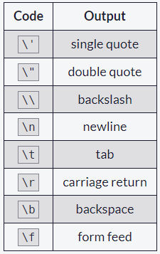
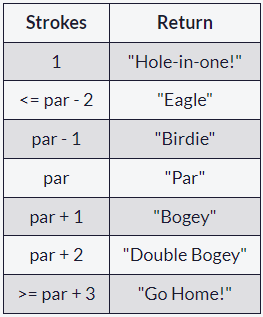
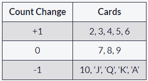

# Introduction to JavaScript
JavaScript is a high-level programming language that all modern web browsers support. It is also one of the core technologies of the web, along with HTML and CSS that you may have learned previously. This section will cover basic JavaScript programming concepts, which range from variables and arithmetic to objects and loops.

If you want to click the content, heres' the link [freeCodeCamp](https://www.freecodecamp.org/learn/javascript-algorithms-and-data-structures/basic-javascript/).

## 1. Comment Your JavaScript Code

Comments are lines of code that JavaScript will intentionally ignore. Comments are a great way to leave notes to yourself and to other people who will later need to figure out what that code does.

There are two ways to write comments in JavaScript:

Using `//` will tell JavaScript to ignore the remainder of the text on the current line. This is an in-line comment:

```
// This is an in-line comment.
```

You can make a multi-line comment beginning with `/*` and ending with `*/`. This is a multi-line comment:

```
/* This is a
multi-line comment */
```

> [!NOTE] 
> As you write code, you should regularly add comments to clarify the function of parts of your code. Good commenting can help communicate the intent of your code—both for others and for your future self.

<hr>

Try creating one of each type of comment.

### The code

```
// the single comment
/* The multi-comment */
```

## 2. Declare JavaScript Variables

In computer science, data is anything that is meaningful to the computer. JavaScript provides eight different data types which are `undefined`, `null`, `boolean`, `string`, `symbol`, `bigint`, `number`, and `object`.

For example, computers distinguish between numbers, such as the number `12`, and strings, such as `"12"`, `"dog"`, or `"123 cats"`, which are collections of characters. Computers can perform mathematical operations on a number, but not on a string.

*Variables* allow computers to store and manipulate data in a dynamic fashion. They do this by using a "label" to point to the data rather than using the data itself. Any of the eight data types may be stored in a variable.

Variables are similar to the x and y variables you use in mathematics, which means they're a simple name to represent the data we want to refer to. Computer variables differ from mathematical variables in that they can store different values at different times.

We tell JavaScript to create or declare a variable by putting the keyword `var` in front of it, like so:

```
var ourName;
```

creates a variable called `ourName`. In JavaScript we end statements with semicolons. Variable names can be made up of numbers, letters, and `$` or `_`, but may not contain spaces or start with a number.

<hr>

Use the `var` keyword to create a variable called `myName`.

### The code
```
var myName;
```

## 3. Storing Values with the Assignment Operator

In JavaScript, you can store a value in a variable with the assignment operator (`=`).

```
myVariable = 5;
```

This assigns the `Number` value `5` to `myVariable`.

If there are any calculations to the right of the `=` operator, those are performed before the value is assigned to the variable on the left of the operator.

```
var myVar;
myVar = 5;
```

First, this code creates a variable named `myVar`. Then, the code assigns `5` to `myVar`. Now, if `myVar` appears again in the code, the program will treat it as if it is `5`.

<hr>

Assign the value `7` to variable `a`.

### The Code

```
// Setup
var a;

// Only change code below this line
a = 7; // The answer!
```

## 4. Assigning the Value of One Variable to Another

After a value is assigned to a variable using the assignment operator, you can assign the value of that variable to another variable using the assignment operator.

```
var myVar;
myVar = 5;
var myNum;
myNum = myVar;
```

The above declares a `myVar` variable with no value, then assigns it the value `5`. Next, a variable named `myNum` is declared with no value. Then, the contents of `myVar` (which is `5`) is assigned to the variable `myNum`. Now, `myNum` also has the value of `5`.

<hr>

Assign the contents of `a` to variable `b`.

### The Code

```
// Setup
var a;
a = 7;
var b;

// Only change code below this line
b = a;
```

## 5. Initializing Variables with the Assignment Operator

It is common to *initialize* a variable to an initial value in the same line as it is declared.

```
var myVar = 0;
```

Creates a new variable called `myVar` and assigns it an initial value of `0`.

<hr>

Define `a` variable a with `var` and initialize it to a value of `9`.

### The Code
```
var a = 9;
```

## 6. Declare String Variables

Previously you used the following code to declare a variable:

```
var myName;
```

But you can also declare a string variable like this:

```
var myName = "your name";
```

`"your name"` is called a string literal. A string literal, or string, is a series of zero or more characters enclosed in single or double quotes.

<hr>

Create two new string variables: `myFirstName` and `myLastName` and assign them the values of your first and last name, respectively.

### The Code

```
var myFirstName = "Edmon";
var myLastName = "Mancao";
```

## 7. Understanding Uninitialized Variables

When JavaScript variables are declared, they have an initial value of `undefined`. If you do a mathematical operation on an `undefined` variable your result will be `NaN` which means "Not a Number". If you concatenate a string with an `undefined` variable, you will get a string of `undefined`.

<hr>

Initialize the three variables `a`, `b`, and `c` with `5`, `10`, and `"I am a"` respectively so that they will not be `undefined`.

### The Code 
```
// Only change code below this line
var a;
var b;
var c;
// Only change code above this line
a = 5;
b = 10;
c = "I am a";

a = a + 1;
b = b + 5;
c = c + " String!";
```

## 8. Understanding Case Sensitivity in Variables

In JavaScript all variables and function names are case sensitive. This means that capitalization matters.

`MYVAR` is not the same as `MyVar` nor `myvar`. It is possible to have multiple distinct variables with the same name but different casing. It is strongly recommended that for the sake of clarity, you do not use this language feature.

### Best Practice

Write variable names in JavaScript in camelCase. In camelCase, multi-word variable names have the first word in lowercase and the first letter of each subsequent word is capitalized.

### Examples:

```
var someVariable;
var anotherVariableName;
var thisVariableNameIsSoLong;
```

<hr>

Modify the existing declarations and assignments so their names use camelCase.

Do not create any new variables.

### The Code

```
// Variable declarations
var studlyCapVar;
var properCamelCase;
var titleCaseOver;

// Variable assignments
studlyCapVar = 10;
properCamelCase = "A String";
titleCaseOver = 9000;
```

## 9. Explore Differences Between the var and let Keywords

One of the biggest problems with declaring variables with the `var` keyword is that you can easily overwrite variable declarations:

```
var camper = "James";
var camper = "David";
console.log(camper);
```

In the code above, the `camper` variable is originally declared as `James`, and is then overridden to be `David`. The console then displays the string `David`.

In a small application, you might not run into this type of problem. But as your codebase becomes larger, you might accidentally overwrite a variable that you did not intend to. Because this behavior does not throw an error, searching for and fixing bugs becomes more difficult.

A keyword called `let` was introduced in ES6, a major update to JavaScript, to solve this potential issue with the `var` keyword. You'll learn about other ES6 features in later challenges.

If you replace `var` with `let` in the code above, it results in an error:

```
let camper = "James";
let camper = "David";
```

The error can be seen in your browser console.

So unlike `var`, when you use `let`, a variable with the same name can only be declared once.

<hr>

Update the code so it only uses the `let` keyword.

### The Code

```
let catName = "Oliver";
let catSound = "Meow!";
```

## 10. Declare a Read-Only Variable with the const Keyword

The keyword `let` is not the only new way to declare variables. In ES6, you can also declare variables using the `const` keyword.

`const` has all the awesome features that `let` has, with the added bonus that variables declared using `const` are read-only. They are a constant value, which means that once a variable is assigned with `const`, it cannot be reassigned:

```
const FAV_PET = "Cats";
FAV_PET = "Dogs";
```

The console will display an error due to reassigning the value of `FAV_PET`.

You should always name variables you don't want to reassign using the const keyword. This helps when you accidentally attempt to reassign a variable that is meant to stay constant.

> [!NOTE] 
> It is common for developers to use uppercase variable identifiers for immutable values and lowercase or camelCase for mutable values (objects and arrays). You will learn more about objects, arrays, and immutable and mutable values in later challenges. Also in later challenges, you will see examples of uppercase, lowercase, or camelCase variable identifiers.

<hr>

Change the code so that all variables are declared using `let` or `const`. Use `let` when you want the variable to change, and `const` when you want the variable to remain constant. Also, rename variables declared with `const` to conform to common practices. Do not change the strings assigned to the variables.

### The Code

```
const FCC = "freeCodeCamp";
let fact = "is cool!";
fact = "is awesome!";
console.log(FCC, fact); //
```

## 11. Add Two Numbers with JavaScript

`Number` is a data type in JavaScript which represents numeric data.

Now let's try to add two numbers using JavaScript.

JavaScript uses the `+` symbol as an addition operator when placed between two numbers.

### Example:

```
const myVar = 5 + 10;
```

`myVar` now has the value `15`.

<hr>

Change the `0` so that sum will equal `20`.

### The Code

```
const sum = 10 + 10;
```

## 12. Subtract One Number from Another with JavaScript

We can also subtract one number from another.

JavaScript uses the - symbol for subtraction.

### Example

```
const myVar = 12 - 6;
```

`myVar` would have the value `6`.

<hr>

Change the `0` so the difference is `12`.

### The Code

```
const difference = 45 - 33;
```

## 13. Multiply Two Numbers with JavaScript

We can also multiply one number by another.

JavaScript uses the `*` symbol for multiplication of two numbers.

### Example

```
const myVar = 13 * 13;
```

`myVar` would have the value `169`.

<hr>

Change the `0` so that product will equal `80`.

### The Code

```
const product = 8 * 10;
```

## 14. Divide One Number by Another with JavaScript

We can also divide one number by another.

JavaScript uses the `/` symbol for division.

### Example

```
const myVar = 16 / 2;
```

`myVar` now has the value `8`.

<hr>

Change the `0` so that the quotient is equal to `2`.

### The Code

```
const quotient = 66 / 33;
```

## 15. Increment a Number with JavaScript

You can easily increment or add one to a variable with the ++ operator.

```
i++;
```

is the equivalent of

```
i = i + 1;
```

> [!NOTE]
> The entire line becomes `i++`;, eliminating the need for the equal sign.

### The Code

```
let myVar = 87;

// Only change code below this line
myVar++;
```

## 16. Decrement a Number with JavaScript

You can easily decrement or decrease a variable by one with the -- operator.

```
i--;
```

is the equivalent of

```
i = i - 1;
```

> [!NOTE]
> The entire line becomes i--;, eliminating the need for the equal sign.

<hr>

Change the code to use the `--` operator on `myVar`.

### The Code

```
let myVar = 11;

// Only change code below this line
myVar--;
```

## 17. Create Decimal Numbers with JavaScript

We can store decimal numbers in variables too. Decimal numbers are sometimes referred to as *floating point numbers* or *floats*.

> [!NOTE] 
> when you compute numbers, they are computed with finite precision. Operations using floating points may lead to different results than the desired outcome. If you are getting one of these results, open a topic on the [freeCodeCamp forum](https://forum.freecodecamp.org/).

<hr>

Create a variable `myDecimal` and give it a decimal value with a fractional part (e.g. `5.7`).

### The Code

```
const ourDecimal = 5.7;

// Only change code below this line
let myDecimal = 5.7;
```

## 18. Multiply Two Decimals with JavaScript

In JavaScript, you can also perform calculations with decimal numbers, just like whole numbers.

Let's multiply two decimals together to get their product.

<hr>

Change the `0.0` so that product will equal `5.0`.

### The Code

```
const product = 2.0 * 2.5;
```

## 19. Divide One Decimal by Another with JavaScript

Now let's divide one decimal by another.

<hr>

Change the `0.0` so that quotient will equal to `2.2`.

### The Code

```
const quotient = 4.4 / 2.0;
```

## 20. Finding a Remainder in JavaScript

The remainder operator `%` gives the remainder of the division of two numbers.

### Example

```
5 % 2 = 1
5 / 2 = 2 remainder 1
2 * 2 = 4
5 - 4 = 1
```

### Usage
In mathematics, a number can be checked to be even or odd by checking the remainder of the division of the number by `2`. Even numbers have a remainder of `0`, while odd numbers a remainder of `1`.

```
17 % 2 = 1
48 % 2 = 0
```

> [!NOTE]
> The remainder operator is sometimes incorrectly referred to as the modulus operator. It is very similar to modulus, but does not work properly with negative numbers.

<hr>

Set `remainder` equal to the remainder of `11` divided by `3` using the remainder (`%`) operator.

### The Code

```
const remainder = 11 % 3;
```

## 21. Compound Assignment With Augmented Addition

In programming, it is common to use assignments to modify the contents of a variable. Remember that everything to the right of the equals sign is evaluated first, so we can say:

```
myVar = myVar + 5;
```

to add `5` to `myVar`. Since this is such a common pattern, there are operators which do both a mathematical operation and assignment in one step.

One such operator is the `+=` operator.

```
let myVar = 1;
myVar += 5;
console.log(myVar);
```

`6` would be displayed in the console.

<hr>

Convert the assignments for `a`, `b`, and `c` to use the `+=` operator.

### The Code

```
let a = 3;
let b = 17;
let c = 12;

// Only change code below this line
a += 12;
b += 9;
c += 7;
```

## 22. Compound Assignment With Augmented Subtraction

Like the `+=` operator, `-=` subtracts a number from a variable.

```
myVar = myVar - 5;
```

will subtract `5` from `myVar`. This can be rewritten as:

```
myVar -= 5;
```

<hr>

Convert the assignments for `a`, `b`, and `c` to use the `-=` operator.

### The Code

```
let a = 11;
let b = 9;
let c = 3;

// Only change code below this line
a -= 6;
b -= 15;
c -= 1;
```

## 23. Compound Assignment With Augmented Multiplication

The `*=` operator multiplies a variable by a number.

```
myVar = myVar * 5;
```

will multiply myVar by 5. This can be rewritten as:

```
myVar *= 5;
```

<hr>

Convert the assignments for `a`, `b`, and `c` to use the `*=` operator.

### The Code

```
let a = 5;
let b = 12;
let c = 4.6;

// Only change code below this line
a *= 5;
b *= 3;
c *= 10;
```

## 24. Compound Assignment With Augmented Division

The `/=` operator divides a variable by another number.

```
myVar = myVar / 5;
```

Will divide `myVar` by `5`. This can be rewritten as:

```
myVar /= 5;
```

<hr>

Convert the assignments for `a`, `b`, and `c` to use the `/=` operator.

### The Code

```
let a = 48;
let b = 108;
let c = 33;

// Only change code below this line
a /= 12;
b /= 4;
c /= 11;
```

## 25. Escaping Literal Quotes in Strings

When you are defining a string you must start and end with a single or double quote. What happens when you need a literal quote: `"` or `'` inside of your string?

In JavaScript, you can escape a quote from considering it as an end of string quote by placing a backslash (`\`) in front of the quote.

```
const sampleStr = "Alan said, \"Peter is learning JavaScript\".";
```

This signals to JavaScript that the following quote is not the end of the string, but should instead appear inside the string. So if you were to print this to the console, you would get:

```
Alan said, "Peter is learning JavaScript".
```

<hr>

Use backslashes to assign a string to the `myStr` variable so that if you were to print it to the console, you would see:

I am a "double quoted" string inside "double quotes".

### The Code 

```
const myStr = "I am a \"double quoted\" string inside \"double quotes\".";
```

## 26. Quoting Strings with Single Quotes

*String* values in JavaScript may be written with single or double quotes, as long as you start and end with the same type of quote. Unlike some other programming languages, single and double quotes work the same in JavaScript.

```
const doubleQuoteStr = "This is a string"; 
const singleQuoteStr = 'This is also a string';
```

The reason why you might want to use one type of quote over the other is if you want to use both in a string. This might happen if you want to save a conversation in a string and have the conversation in quotes. Another use for it would be saving an `<a>` tag with various attributes in quotes, all within a string.

```
const conversation = 'Finn exclaims to Jake, "Algebraic!"';
```

However, this becomes a problem if you need to use the outermost quotes within it. Remember, a string has the same kind of quote at the beginning and end. But if you have that same quote somewhere in the middle, the string will stop early and throw an error.

```
const goodStr = 'Jake asks Finn, "Hey, let\'s go on an adventure?"'; 
const badStr = 'Finn responds, "Let's go!"';
```

Here `badStr` will throw an error.

In the goodStr above, you can use both quotes safely by using the backslash `\` as an escape character.

> [!NOTE] 
> The backslash \ should not be confused with the forward slash /. They do not do the same thing.

<hr>

Change the provided string to a string with single quotes at the beginning and end and no escape characters.

Right now, the `<a>` tag in the string uses double quotes everywhere. You will need to change the outer quotes to single quotes so you can remove the escape characters.

### The Code

```
const myStr = '<a href="http://www.example.com" target="_blank">Link</a>';
```

## 27. Escape Sequences in Strings

Quotes are not the only characters that can be escaped inside a string. Escape sequences allow you to use characters you may not otherwise be able to use in a string.

<figure>
    
    <figcaption>Note that the backslash itself must be escaped in order to display as a backslash.</figcaption>
</figure>

<hr>

Assign the following three lines of text into the single variable `myStr` using escape sequences.

```
FirstLine
    \SecondLine
ThirdLine
```

You will need to use escape sequences to insert special characters correctly. You will also need to follow the spacing as it looks above, with no spaces between escape sequences or words.

> [!NOTE] 
> The indentation for SecondLine is achieved with the tab escape character, not spaces.

### The Code

```
const myStr = "FirstLine\n\t\\SecondLine\nThirdLine"; // Change this line
```

## 28. Concatenating Strings with Plus Operator

In JavaScript, when the `+` operator is used with a `String` value, it is called the concatenation operator. You can build a new string out of other strings by concatenating them together.

### Example

```
'My name is Alan,' + ' I concatenate.'
```

> [!NOTE]
> Watch out for spaces. Concatenation does not add spaces between concatenated strings, so you'll need to add them yourself.

### Example:

```
const ourStr = "I come first. " + "I come second.";
```

The string `I come first. I come second.` would be displayed in the console.

<hr>

Build `myStr` from the strings `This is the start.` and `This is the end.` using the `+` operator. Be sure to include a space between the two strings.

### The Code

```
const myStr = "This is the start." + " This is the end.";
```

## 29. Concatenating Strings with the Plus Equals Operator

We can also use the `+=` operator to concatenate a string onto the end of an existing string variable. This can be very helpful to break a long string over several lines.

Note: Watch out for spaces. Concatenation does not add spaces between concatenated strings, so you'll need to add them yourself.

### Example:

```
let ourStr = "I come first. ";
ourStr += "I come second.";
```

`ourStr` now has a value of the string `I come first. I come second.`.

<hr>

Build `myStr` over several lines by concatenating these two strings: `This is the first sentence.` and `This is the second sentence.` using the `+=` operator. Use the `+=` operator similar to how it is shown in the example and be sure to include a space between the two strings. Start by assigning the first string to `myStr`, then add on the second string.

### The Code

```
let myStr;

myStr = "This is the first sentence.";
myStr += " This is the second sentence."
```

## 30. Constructing Strings with Variables

Sometimes you will need to build a string. By using the concatenation operator (`+`), you can insert one or more variables into a string you're building.

### Example:

```
const ourName = "freeCodeCamp";
const ourStr = "Hello, our name is " + ourName + ", how are you?";
```

`ourStr` would have a value of the string `Hello, our name is freeCodeCamp, how are you?`.

<hr>

Set `myName` to a string equal to your name and build `myStr` with `myName` between the strings `My name is`  and  `and I am well!`

### The Code

```
// Only change code below this line
const myName = "Edmon";
const myStr = "My name is " + myName + " and I am well!";
```

## 31. Appending Variables to Strings

Just as we can build a string over multiple lines out of string literals, we can also append variables to a string using the plus equals (`+=`) operator.

### Example:

```
const anAdjective = "awesome!";
let ourStr = "freeCodeCamp is ";
ourStr += anAdjective;
```

`ourStr` would have the value `freeCodeCamp is awesome!`.

<hr>

Set `someAdjective` to a string of at least 3 characters and append it to `myStr` using the `+=` operator.

### The Code

```
// Change code below this line
const someAdjective = "fun";
let myStr = "Learning to code is ";

myStr += someAdjective;
```

## 32. Find the Length of a String

You can find the length of a `String` value by writing `.length` after the string variable or string literal.

```
console.log("Alan Peter".length);
```

The value `10` would be displayed in the console. Note that the space character between "Alan" and "Peter" is also counted.

For example, if we created a variable `const firstName = "Ada"`, we could find out how long the string `Ada` is by using the `firstName.length` property.

<hr>

Use the `.length` property to set `lastNameLength` to the number of characters in `lastName`.

### The Code

```
// Setup
let lastNameLength = 0;
const lastName = "Lovelace";

// Only change code below this line
lastNameLength = lastName.length;
```

## 33. Use Bracket Notation to Find the First Character in a String

*Bracket notation* is a way to get a character at a specific index within a string.

Most modern programming languages, like JavaScript, don't start counting at 1 like humans do. They start at 0. This is referred to as Zero-based indexing.

For example, the character at index 0 in the word `Charles` is `C`. So if `const firstName = "Charles"`, you can get the value of the first letter of the string by using `firstName[0]`.

### Example

```
const firstName = "Charles";
const firstLetter = firstName[0];
```

`firstLetter` would have a value of the string `C`.

<hr>

Use bracket notation to find the first character in the `lastName` variable and assign it to `firstLetterOfLastName`.

**Hint**: Try looking at the example above if you get stuck.

### The Code

```
// Setup
let firstLetterOfLastName = "";
const lastName = "Lovelace";

// Only change code below this line
firstLetterOfLastName = lastName[0]; // Change this line
```

## 34. Understand String Immutability

In JavaScript, `String` values are *immutable*, which means that they cannot be altered once created.

For example, the following code will produce an error because the letter `B` in the string `Bob` cannot be changed to the letter `J`:

```
let myStr = "Bob";
myStr[0] = "J";
```

Note that this does not mean that `myStr` could not be re-assigned. The only way to change `myStr` would be to assign it with a new value, like this:

```
let myStr = "Bob";
myStr = "Job";
```

<hr>

Correct the assignment to `myStr` so it contains the string value of `Hello World` using the approach shown in the example above.

### The Code

```
// Setup
let myStr = "Jello World";

// Only change code below this line
myStr = "Hello World";
```

## 34. Use Bracket Notation to Find the Nth Character in a String

You can also use bracket notation to get the character at other positions within a string.

Remember that computers start counting at `0`, so the first character is actually the zeroth character.

Example:

```
const firstName = "Ada";
const secondLetterOfFirstName = firstName[1];
```

`secondLetterOfFirstName` would have a value of the string `d`.

<hr>

Let's try to set `thirdLetterOfLastName` to equal the third letter of the `lastName` variable using bracket notation.

**Hint**: Try looking at the example above if you get stuck.

### The Code

```
// Setup
const lastName = "Lovelace";

// Only change code below this line
const thirdLetterOfLastName = lastName[2]; // Change this line
```

## 35. Use Bracket Notation to Find the Last Character in a String

In order to get the last letter of a string, you can subtract one from the string's length.

For example, if `const firstName = "Ada"`, you can get the value of the last letter of the string by using `firstName[firstName.length - 1]`.

### Example:

```
const firstName = "Ada";
const lastLetter = firstName[firstName.length - 1];
```

`lastLetter` would have a value of the string `a`.

<hr>

Use *bracket notation* to find the last character in the `lastName` variable.

**Hint**: Try looking at the example above if you get stuck.

### The Code

```
// Setup
const lastName = "Lovelace";

// Only change code below this line
const lastLetterOfLastName = lastName[lastName.length - 1];
```

## 36. Use Bracket Notation to Find the Nth-to-Last Character in a String

You can use the same principle we just used to retrieve the last character in a string to retrieve the Nth-to-last character.

For example, you can get the value of the third-to-last letter of the `const firstName = "Augusta"` string by using `firstName[firstName.length - 3]`

### Example:

```
const firstName = "Augusta";
const thirdToLastLetter = firstName[firstName.length - 3];
```

`thirdToLastLetter` would have a value of the string `s`.

<hr>

Use *bracket notation* to find the second-to-last character in the `lastName` string.

**Hint**: Try looking at the example above if you get stuck.

### The Code

```
// Setup
const lastName = "Lovelace";

// Only change code below this line
const secondToLastLetterOfLastName = lastName[lastName.length - 2];
```

## 37. Word Blanks

You are provided sentences with some missing words, like nouns, verbs, adjectives and adverbs. You then fill in the missing pieces with words of your choice in a way that the completed sentence makes sense.

Consider this sentence:

```
It was really ____, and we ____ ourselves ____.
```

This sentence has three missing pieces- an adjective, a verb and an adverb, and we can add words of our choice to complete it. We can then assign the completed sentence to a variable as follows:

```
const sentence = "It was really " + "hot" + ", and we " + "laughed" + " ourselves " + "silly" + ".";
```

<hr>

In this challenge, we provide you with a noun, a verb, an adjective and an adverb. You need to form a complete sentence using words of your choice, along with the words we provide.

You will need to use the string concatenation operator `+` to build a new string, using the provided variables: `myNoun`, `myAdjective`, `myVerb`, and `myAdverb`. You will then assign the formed string to the `wordBlanks` variable. You should not change the words assigned to the variables.

You will also need to account for spaces in your string, so that the final sentence has spaces between all the words. The result should be a complete sentence.

### The Code

```
const myNoun = "dog";
const myAdjective = "big";
const myVerb = "ran";
const myAdverb = "quickly";

// Only change code below this line
const wordBlanks = "The " + myAdjective + " " + myNoun + " " + myVerb + " " + myAdverb;
```

## 38. Store Multiple Values in one Variable using JavaScript Arrays

With JavaScript `array` variables, we can store several pieces of data in one place.

You start an array declaration with an opening square bracket, end it with a closing square bracket, and put a comma between each entry, like this:

```
const sandwich = ["peanut butter", "jelly", "bread"];
```

<hr>

Modify the new array `myArray` so that it contains both a string and a number (in that order).

### The Code

```
// Only change code below this line
const myArray = ["Python", 2, "Lua"];
```

## 39. Nest one Array within Another Array

You can also nest arrays within other arrays, like below:

```
const teams = [["Bulls", 23], ["White Sox", 45]];
```

This is also called a *multi-dimensional array*.

<hr>

Create a nested array called `myArray`.

```
// Only change code below this line
const myArray = [[1, "one"], [3, "five", 23.5]];
```

## 40. Access Array Data with Indexes

We can access the data inside arrays using `indexes`.

Array indexes are written in the same bracket notation that strings use, except that instead of specifying a character, they are specifying an entry in the array. Like strings, arrays use *zero-based* indexing, so the first element in an array has an index of `0`.

### Example

```
const array = [50, 60, 70];
console.log(array[0]);
const data = array[1];
```

The `console.log(array[0])` prints `50`, and `data` has the value `60`.

<hr>

Create a variable called `myData` and set it to equal the first value of `myArray` using bracket notation.

### The Code

```
const myArray = [50, 60, 70];
let myData = myArray[0];
```

## 41. Modify Array Data With Indexes

Unlike strings, the entries of arrays are *mutable* and can be changed freely, even if the array was declared with `const`.

### Example

```
const ourArray = [50, 40, 30];
ourArray[0] = 15;
```

`ourArray` now has the value `[15, 40, 30]`.

> [!NOTE]
> There shouldn't be any spaces between the array name and the square brackets, like array [0]. Although JavaScript is able to process this correctly, this may confuse other programmers reading your code.

<hr>

Modify the data stored at index `0` of `myArray` to a value of `45`.

### The Code 

```
// Setup
const myArray = [18, 64, 99];

// Only change code below this line
myArray[0] = 45;
```

## 42. Access Multi-Dimensional Arrays With Indexes

One way to think of a multi-dimensional array, is as an *array of arrays*. When you use brackets to access your array, the first set of brackets refers to the entries in the outermost (the first level) array, and each additional pair of brackets refers to the next level of entries inside.

### Example

```
const arr = [
  [1, 2, 3],
  [4, 5, 6],
  [7, 8, 9],
  [[10, 11, 12], 13, 14]
];

const subarray = arr[3];
const nestedSubarray = arr[3][0];
const element = arr[3][0][1];
```

In this example, `subarray` has the value `[[10, 11, 12], 13, 14]`, `nestedSubarray` has the value `[10, 11, 12]`, and element has the value `11` .

**Note**: There shouldn't be any spaces between the array name and the square brackets, like `array [0][0]` and even this `array [0] [0]` is not allowed. Although JavaScript is able to process this correctly, this may confuse other programmers reading your code.

<hr>

Using bracket notation select an element from `myArray` such that `myData` is equal to `8`.

### The Code

```
const myArray = [
  [1, 2, 3],
  [4, 5, 6],
  [7, 8, 9],
  [[10, 11, 12], 13, 14],
];

const myData = myArray[2][1];
```

## 43. Manipulate Arrays With push Method

An easy way to append data to the end of an array is via the `push()` method.

The `push()` method takes one or more arguments and appends them to the end of the array, in the order in which they appear. It returns the new length of the array.

Examples:
```
const arr1 = [1, 2, 3];
arr1.push(4, 5);

const arr2 = ["Stimpson", "J", "cat"];
arr2.push(["happy", "joy"]);
```

`arr1` now has the value `[1, 2, 3, 4, 5]` and `arr2` has the value `["Stimpson", "J", "cat", ["happy", "joy"]]`.

<hr>

Push `["dog", 3]` onto the end of the `myArray` variable.

### The Code

```
// Setup
const myArray = [["John", 23], ["cat", 2]];

// Only change code below this line
myArray.push(["dog", 3]);
```

## 44. Manipulate Arrays With pop Method

Another way to change the data in an array is with the `.pop()` function.

`.pop()` is used to pop a value off of the end of an array. We can store this popped off value by assigning it to a variable. In other words, `.pop()` removes the last element from an array and returns that element.

Any type of entry can be popped off of an array - numbers, strings, even nested arrays.

```
const threeArr = [1, 4, 6];
const oneDown = threeArr.pop();
console.log(oneDown);
console.log(threeArr);
```

The first `console.log` will display the value `6`, and the second will display the value `[1, 4]`.

<hr>

Use the `.pop()` function to remove the last item from `myArray` and assign the popped off value to a new variable, `removedFromMyArray`.

### The Code

```
// Setup
const myArray = [["John", 23], ["cat", 2]];

// Only change code below this line
let removedFromMyArray = myArray.pop();
```

## 45. Manipulate Arrays With shift Method

`pop() `always removes the last element of an array. What if you want to remove the first?

That's where `.shift()` comes in. It works just like `.pop()`, except it removes the first element instead of the last.

Example:

```
const ourArray = ["Stimpson", "J", ["cat"]];
const removedFromOurArray = ourArray.shift();
```

`removedFromOurArray` would have a value of the string `Stimpson`, and `ourArray` would have `["J", ["cat"]]`.

<hr>

Use the `.shift()` function to remove the first item from `myArray` and assign the "shifted off" value to a new variable, `removedFromMyArray`.

### The Code

```
// Setup
const myArray = [["John", 23], ["dog", 3]];

// Only change code below this line
let removedFromMyArray = myArray.shift();
```

## 46. Manipulate Arrays With unshift Method

Not only can you `shift` elements off of the beginning of an array, you can also `unshift` elements to the beginning of an array i.e. add elements in front of the array.

`.unshift()` works exactly like `.push()`, but instead of adding the element at the end of the array, `unshift()` adds the element at the beginning of the array.

Example:

```
const ourArray = ["Stimpson", "J", "cat"];
ourArray.shift();
ourArray.unshift("Happy");
```

After the shift, ourArray would have the value ["J", "cat"]. After the unshift, ourArray would have the value ["Happy", "J", "cat"].

<hr>

Add `["Paul", 35]` to the beginning of the `myArray` variable using `unshift()`.

### The Code

```
// Setup
const myArray = [["John", 23], ["dog", 3]];
myArray.shift();

// Only change code below this line
myArray.unshift(["Paul", 35]);
```

## 47. Shopping List

Create a shopping list in the variable `myList`. The list should be a multi-dimensional array containing several sub-arrays.

The first element in each sub-array should contain a string with the name of the item. The second element should be a number representing the quantity i.e.

```
["Chocolate Bar", 15]
```

There should be at least 5 sub-arrays in the list.

### The Code

```
const myList = [
  ["Fish", 25],
  ["Chicken", 32],
  ["Egg", 13],
  ["Vegetable", 27],
  ["Fruits", 12]
];
```

## 48. Write Reusable JavaScript with Functions

In JavaScript, we can divide up our code into reusable parts called functions.

Here's an example of a function:

```
function functionName() {
  console.log("Hello World");
}
```

You can call or invoke this function by using its name followed by parentheses, like this: `functionName()`; Each time the function is called it will print out the message `Hello World` on the dev console. All of the code between the curly braces will be executed every time the function is called.

<hr>

1. Create a function called reusableFunction which prints the string Hi World to the dev console.

2. Call the function.

### The Code

```
function reusableFunction(){
  console.log("Hi World");
}

reusableFunction();
```

## 49. Passing Values to Functions with Arguments

*Parameters* are variables that act as placeholders for the values that are to be input to a function when it is called. When a function is defined, it is typically defined along with one or more parameters. The actual values that are input (or "passed") into a function when it is called are known as *arguments*.

Here is a function with two parameters, `param1` and `param2`:

```
function testFun(param1, param2) {
  console.log(param1, param2);
}
```

Then we can call `testFun` like this: `testFun("Hello", "World");`. We have passed two string arguments, `Hello` and `World`. Inside the function, `param1` will equal the string `Hello` and `param2` will equal the string `World`. Note that you could call `testFun` again with different arguments and the parameters would take on the value of the new arguments.

<hr>

1. Create a function called `functionWithArgs` that accepts two arguments and outputs their sum to the dev console.

2. Call the function with two numbers as arguments.

### The Code

```
function functionWithArgs(num1, num2){
  let result = num1 + num2;
  console.log(result);
}

functionWithArgs(1, 2);
```

## 50. Return a Value from a Function with Return
We can pass values into a function with arguments. You can use a `return` statement to send a value back out of a function.

### Example

```
function plusThree(num) {
  return num + 3;
}

const answer = plusThree(5);
```

`answer` has the value `8`.

`plusThree` takes an argument for `num` and returns a value equal to `num + 3`.

<hr>

Create a function `timesFive` that accepts one argument, multiplies it by `5`, and returns the new value.

### The Code

```
function timesFive(num){
  let result = num * 5;
  return result;
}

let number = timesFive(5);
console.log(number);
```

## 51. Global Scope and Functions

In JavaScript, *scope* refers to the visibility of variables. Variables which are defined outside of a function block have *Global* scope. This means, they can be seen everywhere in your JavaScript code.

Variables which are declared without the `let` or `const` keywords are automatically created in the `global` scope. This can create unintended consequences elsewhere in your code or when running a function again. You should always declare your variables with `let` or `const`.

<hr>

Using `let` or `const`, declare a global variable named `myGlobal` outside of any function. Initialize it with a value of `10`.

Inside function `fun1`, assign `5` to `oopsGlobal` ***without*** using the `var`, `let` or `const` keywords.

### The Code

```
// Declare the myGlobal variable below this line
let myGlobal = 10;

function fun1() {
  // Assign 5 to oopsGlobal here
  oopsGlobal = 5;
}

// Only change code above this line

function fun2() {
  let output = "";
  if (typeof myGlobal != "undefined") {
    output += "myGlobal: " + myGlobal;
  }
  if (typeof oopsGlobal != "undefined") {
    output += " oopsGlobal: " + oopsGlobal;
  }
  console.log(output);
}
```

## 52. Local Scope and Functions

Variables which are declared within a function, as well as the function parameters, have local scope. That means they are only visible within that function.

Here is a function `myTest` with a local variable called `loc`.

```
function myTest() {
  const loc = "foo";
  console.log(loc);
}

myTest();
console.log(loc);
```

The `myTest()` function call will display the string `foo` in the console. `The console.log(loc)` line (outside of the myTest function) will throw an error, as `loc` is not defined outside of the function.

<hr>

The editor has two `console.log`s to help you see what is happening. Check the console as you code to see how it changes. Declare a local variable `myVar` inside `myLocalScope` and run the tests.

**Note**: The console will still display `ReferenceError: myVar is not defined`, but this will not cause the tests to fail.

### The Code

```
function myLocalScope() {
  // Only change code below this line
  let myVar = "test";
  console.log('inside myLocalScope', myVar);
}
myLocalScope();

// Run and check the console
// myVar is not defined outside of myLocalScope
console.log('outside myLocalScope', myVar);
```

## 53. Global vs. Local Scope in Functions

It is possible to have both `local` and `global` variables with the same name. When you do this, the local variable takes precedence over the global variable.

In this example:

```
const someVar = "Hat";

function myFun() {
  const someVar = "Head";
  return someVar;
}
```

The function `myFun` will return the string `Head` because the local version of the variable is present.

<hr>

Add a local variable to `myOutfit` function to override the value of `outerWear` with the string `sweater`.

### The Code 
```
// Setup
const outerWear = "T-Shirt";

function myOutfit() {
  // Only change code below this line
  let outerWear = "sweater";
  // Only change code above this line
  return outerWear;
}

myOutfit();
```

## 54. Understanding Undefined Value returned from a Function

A function can include the return statement but it does not have to. In the case that the function doesn't have a return statement, when you call it, the function processes the inner code but the returned value is undefined.

**Example**

```
let sum = 0;

function addSum(num) {
  sum = sum + num;
}

addSum(3);
```

`addSum` is a function without a `return` statement. The function will change the global `sum` variable but the returned value of the function is `undefined`.

<hr>

Create a function `addFive` without any arguments. This function adds 5 to the `sum` variable, but its returned value is `undefined`.


### The Code 

```
// Setup
let sum = 0;

function addThree() {
  sum = sum + 3;
}

// Only change code below this line
function addFive(){
  sum = sum + 5;
}

// Only change code above this line

addThree();
addFive();
```

## 55. Assignment with a Returned Value

If you'll recall from our discussion about [Storing Values with the Assignment Operator](https://www.freecodecamp.org/learn/javascript-algorithms-and-data-structures/basic-javascript/storing-values-with-the-assignment-operator), everything to the right of the equal sign is resolved before the value is assigned. This means we can take the return value of a function and assign it to a variable.

Assume we have defined a function `sum` which adds two numbers together.

```
ourSum = sum(5, 12);
```

Calling the `sum` function with the arguments of `5` and `12` produces a return value of `17`. This return value is assigned to the `ourSum` variable.

<hr>

Call the `processArg` function with an argument of `7` and assign its return value to the variable `processed`.

### The Code

```
// Setup
let processed = 0;

function processArg(num) {
  return (num + 3) / 5;
}

// Only change code below this line
processed = processArg(7);
```

## 56. Stand in Line

In Computer Science a *queue* is an abstract *Data Structure* where items are kept in order. New items can be added at the back of the queue and old items are taken off from the front of the queue.

<hr>

Write a function `nextInLine` which takes an array (`arr`) and a number (`item`) as arguments.

Add the number to the end of the array, then remove the first element of the array.

The `nextInLine` function should then return the element that was removed.

## 57. Understanding Boolean Values

Another data type is the Boolean. Booleans may only be one of two values: `true` or `false`. They are basically little on-off switches, where `true` is on and `false` is off. These two states are mutually exclusive.

Note: Boolean values are never written with quotes. The strings `"true"` and `"false"` are not Boolean and have no special meaning in JavaScript.

<hr>

Modify the `welcomeToBooleans` function so that it returns `true` instead of `false`.

### The Code

```
function welcomeToBooleans() {
  // Only change code below this line

  return true; // Change this line

  // Only change code above this line
}
```

## 58. Use Conditional Logic with If Statements

if statements are used to make decisions in code. The keyword if tells JavaScript to execute the code in the curly braces under certain conditions, defined in the parentheses. These conditions are known as Boolean conditions and they may only be true or false.

When the condition evaluates to true, the program executes the statement inside the curly braces. When the Boolean condition evaluates to false, the statement inside the curly braces will not execute.

**Pseudocode**

```
if (condition is true) {
  statement is executed
}
```

**Example**
```
function test(myCondition) {
  if (myCondition) {
    return "It was true";
  }
  return "It was false";
}

test(true);
test(false);
```

`test(true)` returns the string `It was true`, and `test(false)` returns the string `It was false`.

When `test` is called with a value of `true`, the `if` statement evaluates `myCondition` to see if it is `true` or not. Since it is `true`, the function returns `It was true`. When we call `test` with a value of `false`, `myCondition` is not `true` and the statement in the curly braces is not executed and the function returns `It was false`.

<hr>

Create an `if` statement inside the function to return `Yes, that was true` if the parameter `wasThatTrue` is `true` and return `No, that was false` otherwise.

### The Code

```
function trueOrFalse(wasThatTrue) {
    // Only change code below this line
    if (wasThatTrue){
        return "Yes, that was true";
    } else {
        return "No, that was false";
    }
    // Only change code above this line
  
}
```

## 59. Comparison with the Equality Operator

There are many *comparison operators* in JavaScript. All of these operators return a boolean `true` or `false` value.

The most basic operator is the equality operator `==`. The equality operator compares two values and returns `true` if they're equivalent or `false` if they are not. Note that equality is different from assignment (`=`), which assigns the value on the right of the operator to a variable on the left.

```
function equalityTest(myVal) {
  if (myVal == 10) {
    return "Equal";
  }
  return "Not Equal";
}
```

If `myVal` is equal to `10`, the equality operator returns `true`, so the code in the curly braces will execute, and the function will return `Equal`. Otherwise, the function will return `Not Equal`. In order for JavaScript to compare two different data types (for example, `numbers` and `strings`), it must convert one type to another. This is known as Type Coercion. Once it does, however, it can compare terms as follows:

```
1   ==  1  // true
1   ==  2  // false
1   == '1' // true
"3" ==  3  // true
```

<hr>

Add the equality operator to the indicated line so that the function will return the string `Equal` when `val` is equivalent to `12`.

### The Code

```
// Setup
function testEqual(val) {
  if (val == 12) { // Change this line
    return "Equal";
  }
  return "Not Equal";
}

testEqual(10);
```

## 60. Comparison with the Strict Equality Operator

Strict equality (`===`) is the counterpart to the equality operator (`==`). However, unlike the equality operator, which attempts to convert both values being compared to a common type, the strict equality operator does not perform a type conversion.

If the values being compared have different types, they are considered unequal, and the strict equality operator will return false.

**Examples**

```
3 ===  3  // true
3 === '3' // false
```

In the second example, `3` is a `Number` type and `'3'` is a `String` type.

<hr>

Use the strict equality operator in the `if` statement so the function will return the string `Equal` when `val` is strictly equal to `7`.

### The Code

```
// Setup
function testStrict(val) {
    if (val === 7) { // Change this line
      return "Equal";
    }
    return "Not Equal";
}
  
testStrict(10);
```

## 61. Practice comparing different values


In the last two challenges, we learned about the equality operator (`==`) and the strict equality operator (`===`). Let's do a quick review and practice using these operators some more.

If the values being compared are not of the same type, the equality operator will perform a type conversion, and then evaluate the values. However, the strict equality operator will compare both the data type and value as-is, without converting one type to the other.

**Examples**

`3 == '3'` returns `true` because JavaScript performs type conversion from string to number. `3 === '3'` returns false because the types are different and type conversion is not performed.

**Note**: In JavaScript, you can determine the type of a variable or a value with the `typeof` operator, as follows:

```
typeof 3
typeof '3'
```

`typeof 3` returns the string `number`, and `typeof '3'` returns the string `string`.

<hr>

The `compareEquality` function in the editor compares two values using the equality operator. Modify the function so that it returns the string `Equal` only when the values are strictly equal.

### The Code

```
// Setup
function compareEquality(a, b) {
  if (a === b) { // Change this line
    return "Equal";
  }
  return "Not Equal";
}

compareEquality(10, "10");
```

## 62. Comparison with the Inequality Operator

The inequality operator (`!=`) is the opposite of the equality operator. It means not equal and returns `false` where equality would return `true` and vice versa. Like the equality operator, the inequality operator will convert data types of values while comparing.

**Examples**

```
1 !=  2    // true
1 != "1"   // false
1 != '1'   // false
1 != true  // false
0 != false // false
```

<hr>

Add the inequality operator `!=` in the `if` statement so that the function will return the string `Not Equal` when `val` is not equivalent to `99`.

### The Code

```
// Setup
function testNotEqual(val) {
  if (val != 99) { // Change this line
    return "Not Equal";
  }
  return "Equal";
}

testNotEqual(10);
```

## 63. Comparison with the Strict Inequality Operator

The strict inequality operator (!==) is the logical opposite of the strict equality operator. It means "Strictly Not Equal" and returns false where strict equality would return true and vice versa. The strict inequality operator will not convert data types.

**Examples**

```
3 !==  3  // false
3 !== '3' // true
4 !==  3  // true
```

<hr> 

Add the strict inequality operator to the `if` statement so the function will return the string `Not Equal` when `val` is not strictly equal to `17`

### The Code

```
// Setup
function testStrictNotEqual(val) {
  if (val !== 17) { // Change this line
    return "Not Equal";
  }
  return "Equal";
}

testStrictNotEqual(10);
```

## 64. Comparison with the Greater Than Operator

The greater than operator (`>`) compares the values of two numbers. If the number to the left is greater than the number to the right, it returns `true`. Otherwise, it returns `false`.

Like the equality operator, the greater than operator will convert data types of values while comparing.

**Examples**

```
5   >  3  // true
7   > '3' // true
2   >  3  // false
'1' >  9  // false
```

<hr>

Add the greater than operator to the indicated lines so that the return statements make sense.

### The Code

```
function testGreaterThan(val) {
  if (val > 100) {  // Change this line
    return "Over 100";
  }

  if (val > 10) {  // Change this line
    return "Over 10";
  }

  return "10 or Under";
}

testGreaterThan(10);
```

## 65. Comparison with the Greater Than Or Equal To Operator

The greater than or equal to operator (`>=`) compares the values of two numbers. If the number to the left is greater than or equal to the number to the right, it returns `true`. Otherwise, it returns `false`.

Like the equality operator, the greater than or equal to operator will convert data types while comparing.

**Examples**

```
6   >=  6  // true
7   >= '3' // true
2   >=  3  // false
'7' >=  9  // false
```

<hr>

Add the greater than or equal to operator to the indicated lines so that the return statements make sense.

### The Code

```
function testGreaterOrEqual(val) {
  if (val >= 20) {  // Change this line
    return "20 or Over";
  }

  if (val >= 10) {  // Change this line
    return "10 or Over";
  }

  return "Less than 10";
}

testGreaterOrEqual(10);
```

## 66. Comparison with the Less Than Operator

The less than operator (`<`) compares the values of two numbers. If the number to the left is less than the number to the right, it returns `true`. Otherwise, it returns `false`. Like the equality operator, the less than operator converts data types while comparing.

**Examples**

```
2   < 5 // true
'3' < 7 // true
5   < 5 // false
3   < 2 // false
'8' < 4 // false
```

<hr>

Add the less than operator to the indicated lines so that the return statements make sense.

### The Code

```
function testLessThan(val) {
  if (val < 25) {  // Change this line
    return "Under 25";
  }

  if (val < 55) {  // Change this line
    return "Under 55";
  }

  return "55 or Over";
}

testLessThan(10);
```

## 67. Comparison with the Less Than Or Equal To Operator

The less than or equal to operator (<=) compares the values of two numbers. If the number to the left is less than or equal to the number to the right, it returns true. If the number on the left is greater than the number on the right, it returns false. Like the equality operator, the less than or equal to operator converts data types.

Examples

```
4   <= 5 // true
'7' <= 7 // true
5   <= 5 // true
3   <= 2 // false
'8' <= 4 // false
```

<hr>

Add the less than or equal to operator to the indicated lines so that the return statements make sense.

### The Code

```
function testLessOrEqual(val) {
  if (val <= 12) {  // Change this line
    return "Smaller Than or Equal to 12";
  }

  if (val <= 24) {  // Change this line
    return "Smaller Than or Equal to 24";
  }

  return "More Than 24";
}

testLessOrEqual(10);
```

## 68. Comparisons with the Logical And Operator

Sometimes you will need to test more than one thing at a time. The logical and operator (`&&`) returns `true` if and only if the *operands* to the left and right of it are true.

The same effect could be achieved by nesting an `if` statement inside another `if`.

```
if (num > 5) {
  if (num < 10) {
    return "Yes";
  }
}
return "No";
```

This code will return `Yes` if `num` is greater than `5` and less than `10`. The same logic can be written with the logical and operator.

```
if (num > 5 && num < 10) {
  return "Yes";
}
return "No";
```

<hr>

Replace the two if statements with one statement, using the `&&` operator, which will return the string `Yes` if `val` is less than or equal to `50` and greater than or equal to `25`. Otherwise, will return the string `No`.

### The Code

```
function testLogicalAnd(val) {
  // Only change code below this line

  if (val <= 50 && val >= 25) {
    return "Yes";
  }

  // Only change code above this line
  return "No";
}

testLogicalAnd(10);
```

## 69. Comparisons with the Logical Or Operator

The *logical* or operator (`||`) returns `true` if either of the *operands* is `true`. Otherwise, it returns `false`.

The *logical* or operator is composed of two pipe symbols: (`||`). This can typically be found between your Backspace and Enter keys.

The pattern below should look familiar from prior waypoints.

```
if (num > 10) {
  return "No";
}
if (num < 5) {
  return "No";
}
return "Yes";
```

This code will return `Yes` if `num` is between `5` and `10` (`5` and `10` included). The same logic can be written with the *logical* or operator.

```
if (num > 10 || num < 5) {
  return "No";
}
return "Yes";
```

<hr>

Combine the two `if` statements into one statement which returns the string `Outside` if `val` is not between `10` and `20`, inclusive. Otherwise, return the string `Inside`.

### The Code

```
function testLogicalOr(val) {
  // Only change code below this line

  if (val < 10 || val > 20) {
    return "Outside";
  }

  // Only change code above this line
  return "Inside";
}

testLogicalOr(15);
```

### 70. Introducing Else Statements

When a condition for an `if` statement is true, the block of code following it is executed. What about when that condition is false? Normally nothing would happen. With an `else` statement, an alternate block of code can be executed.

```
if (num > 10) {
  return "Bigger than 10";
} else {
  return "10 or Less";
}
```

<hr>

Combine the `if` statements into a single `if/else` statement.

### The Code 

```
function testElse(val) {
  let result = "";
  // Only change code below this line

  if (val > 5) {
    result = "Bigger than 5";
  } else {
    result = "5 or Smaller";
  }

  // Only change code above this line
  return result;
}

testElse(4);
```

## 71. Introducing Else If Statements

If you have multiple conditions that need to be addressed, you can chain `if` statements together with `else if` statements.

```
if (num > 15) {
  return "Bigger than 15";
} else if (num < 5) {
  return "Smaller than 5";
} else {
  return "Between 5 and 15";
}
```

Convert the logic to use `else if` statements.

### The Code

```
function testElseIf(val) {
  if (val > 10) {
    return "Greater than 10";
  } else if (val < 5) {
    return "Smaller than 5";
  } else {
    return "Between 5 and 10";
  }
}

testElseIf(7);
```

## 72. Logical Order in If Else Statements

Order is important in `if`, `else if` statements.

The function is executed from top to bottom so you will want to be careful of what statement comes first.

Take these two functions as an example.

Here's the first:

```
function foo(x) {
  if (x < 1) {
    return "Less than one";
  } else if (x < 2) {
    return "Less than two";
  } else {
    return "Greater than or equal to two";
  }
}
```

And the second just switches the order of the statements:

```
function bar(x) {
  if (x < 2) {
    return "Less than two";
  } else if (x < 1) {
    return "Less than one";
  } else {
    return "Greater than or equal to two";
  }
}
```

While these two functions look nearly identical if we pass a number to both we get different outputs.

```
foo(0)
bar(0)
```

`foo(0)` will return the string `Less than one`, and `bar(0)` will return the string `Less than two`.

### The Code 
```
function orderMyLogic(val) {
  if (val < 5) {
    return "Less than 5";
  } else if (val < 10) {
    return "Less than 10";
  } else {
    return "Greater than or equal to 10";
  }
}

orderMyLogic(7);
```

## 73. Chaining If Else Statements

`if/else` statements can be chained together for complex logic. Here is pseudocode of multiple chained `if` / `else if` statements:

```
if (condition1) {
  statement1
} else if (condition2) {
  statement2
} else if (condition3) {
  statement3
. . .
} else {
  statementN
}
```

<hr>

Write chained `if` / `else if` statements to fulfill the following conditions:


- `num < 5` - return `Tiny`
- `num < 10` - return `Small`
- `num < 15` - return `Medium`
- `num < 20` - return `Large`
- `num >= 20` - return `Huge`


### The Code

```
function testSize(num) {
  // Only change code below this line
  if (num < 5) {
    return "Tiny";
  } else if (num < 10){
    return "Small";
  } else if (num < 15){
    return "Medium";
  } else if (num < 20){
    return "Large";
  } else {
    return "Huge";
  }

  return "Change Me";
  // Only change code above this line
}

testSize(7);
```

## 74. Golf Code

In the game of Golf, each hole has a `par`, meaning, the average number of `strokes` a golfer is expected to make in order to sink the ball in the hole to complete the play. Depending on how far above or below `par` your `strokes` are, there is a different nickname.

Your function will be passed `par` and `strokes` arguments. Return the correct string according to this table which lists the strokes in order of priority; top (highest) to bottom (lowest):

<figure>
  
</figure>

`par` and `strokes` will always be numeric and positive. We have added an array of all the names for your convenience.

### The Code 

```
const names = ["Hole-in-one!", "Eagle", "Birdie", "Par", "Bogey", "Double Bogey", "Go Home!"];

function golfScore(par, strokes) {
  // Only change code below this line
  if (strokes === 1) {
    return "Hole-in-one!";
  } else if (strokes <= par - 2) {
    return "Eagle";
  } else if (strokes === par - 1) {
    return "Birdie";
  } else if (strokes === par) {
    return "Par";
  } else if (strokes === par + 1) {
    return "Bogey";
  } else if (strokes === par + 2) {
    return "Double Bogey";
  } else if (strokes >= par + 3) {
    return "Go Home!";
  }


  // Only change code above this line
}

golfScore(5, 4);
```

## 75. Selecting from Many Options with Switch Statements

If you need to match one value against many options, you can use a switch statement. A `switch` statement compares the value to the case statements which define various possible values. Any valid JavaScript statements can be executed inside a case block and will run from the first matched `case` value until a `break` is encountered.

Here is an example of a `switch` statement:

```
switch (fruit) {
  case "apple":
    console.log("The fruit is an apple");
    break;
  case "orange":
    console.log("The fruit is an orange");
    break;
}
```

`case` values are tested with strict equality (`===`). The `break` tells JavaScript to stop executing statements. If the `break` is omitted, the next statement will be executed.

<hr>

Write a switch statement which tests `val` and sets `answer` for the following conditions:

- `1` - `alpha`
- `2` - `beta`
- `3` - `gamma`
- `4` - `delta`

### The Code

```
function caseInSwitch(val) {
    let answer = "";
    // Only change code below this line
    switch(val){
      case 1:
        answer = "alpha";
        break;
      case 2:
        answer = "beta";
        break;
      case 3:
        answer = "gamma";
        break;
      case 4:
        answer = "delta";
        break;
    }
    // Only change code above this line
    return answer;
}
  
caseInSwitch(1);
```

## 76. Adding a Default Option in Switch Statements

In a `switch` statement you may not be able to specify all possible values as `case` statements. Instead, you can add the `default` statement which will be executed if no matching `case` statements are found. Think of it like the final `else` statement in an `if/else` chain.

A `default` statement should be the last case.

```
switch (num) {
  case value1:
    statement1;
    break;
  case value2:
    statement2;
    break;
...
  default:
    defaultStatement;
    break;
}
```

<hr>

Write a switch statement to set `answer` for the following conditions:
- `a` - `apple`
- `b` - `bird`
- `c` - `cat`
- `default` - `stuff`


### The Code 

```
function switchOfStuff(val) {
    let answer = "";
    // Only change code below this line
    switch(val){
        case "a":
          answer = "apple";
          break;
        case "b":
          answer = "bird";
          break;
        case "c":
          answer = "cat";
          break;
        default:
          answer = "stuff";
    }
  
    // Only change code above this line
    return answer;
}
  
switchOfStuff(1);
```

## 77. Multiple Identical Options in Switch Statements

If the `break` statement is omitted from a `switch` statement's `case`, the following `case` statement(s) are executed until a `break` is encountered. If you have multiple inputs with the same output, you can represent them in a `switch` statement like this:

```
let result = "";
switch (val) {
  case 1:
  case 2:
  case 3:
    result = "1, 2, or 3";
    break;
  case 4:
    result = "4 alone";
}
```

Cases for 1, 2, and 3 will all produce the same result.

<hr>

Write a switch statement to set `answer` for the following ranges:

- `1-3` - `Low`
- `4-6` - `Mid`
- `7-9` - `High`

**Note**: You will need to have a `case` statement for each number in the range.

### The Code 
```
function sequentialSizes(val) {
    let answer = "";
    // Only change code below this line
    switch(val){
        case 1:
        case 2:
        case 3:
            answer = "Low";
            break;
        case 4:
        case 5:
        case 6:
            answer = "Mid";
            break;
        case 7:
        case 8:
        case 9:
            answer = "High";
            break;
    }
  
  
  
    // Only change code above this line
    return answer;
}
  
sequentialSizes(1);
```

## 78. Replacing If Else Chains with Switch

If you have many options to choose from, a `switch` statement can be easier to write than many chained `if` / `else if` statements. The following:

```
if (val === 1) {
  answer = "a";
} else if (val === 2) {
  answer = "b";
} else {
  answer = "c";
}
```

can be replaced with:

```
switch (val) {
  case 1:
    answer = "a";
    break;
  case 2:
    answer = "b";
    break;
  default:
    answer = "c";
}
```

<hr>

Change the chained `if` / `else if` statements into a `switch` statement.

### The Code

```
function chainToSwitch(val) {
    let answer = "";
    // Only change code below this line
    switch (val){
        case "bob":
            answer = "Marley";
            break;
        case 42:
            answer = "The Answer";
            break;
        case 1:
            answer = "There is no #1";
            break;
        case 99:
            answer = "Missed me by this much!";
            break;
        case 7:
            answer = "Ate Nine";
            break;
    }
    // Only change code above this line
    return answer;
}

chainToSwitch(7);
```

## 79. Returning Boolean Values from Functions

You may recall from Comparison with the Equality Operator that all comparison operators return a boolean `true` or `false` value.

Sometimes people use an `if/else` statement to do a comparison, like this:

```
function isEqual(a, b) {
  if (a === b) {
    return true;
  } else {
    return false;
  }
}
```

But there's a better way to do this. Since `===` returns `true` or `false`, we can return the result of the comparison:

```
function isEqual(a, b) {
  return a === b;
}
```

<hr>

Fix the function `isLess` to remove the `if/else` statements.

### The Code 
```
function isLess(a, b) {
    // Only change code below this line
    return a < b;
    // Only change code above this line
  }
  
  isLess(10, 15);
```

## 80. Return Early Pattern for Functions

When a `return` statement is reached, the execution of the current function stops and control returns to the calling location.

**Example**

```
function myFun() {
  console.log("Hello");
  return "World";
  console.log("byebye")
}
myFun();
```

The above will display the string `Hello` in the console, and return the string `World`. The string `byebye` will never display in the console, because the function exits at the `return` statement.

<hr>

Modify the function `abTest` so that if `a` or `b` are less than `0` the function will immediately exit with a value of `undefined`.

**Hint** Remember that undefined is a keyword, not a string.

### The Code 

```
// Setup
function abTest(a, b) {
    // Only change code below this line
    if (a < 0 || b < 0) {
        return undefined;
    }
    
  
    // Only change code above this line
  
    return Math.round(Math.pow(Math.sqrt(a) + Math.sqrt(b), 2));
  }
  
  abTest(2,2);
```

## 81. Counting Cards

In the casino game Blackjack, a player can determine whether they have an advantage on the next hand over the house by keeping track of the relative number of high and low cards remaining in the deck. This is called Card Counting.

Having more high cards remaining in the deck favors the player. Each card is assigned a value according to the table below. When the count is positive, the player should bet high. When the count is zero or negative, the player should bet low.

<figure>
    
</figure>

You will write a card counting function. It will receive a `card` parameter, which can be a number or a string, and increment or decrement the global `count` variable according to the card's value (see table). The function will then return a string with the current count and the string `Bet` if the count is positive, or `Hold` if the count is zero or negative. The current count and the player's decision (`Bet` or `Hold`) should be separated by a single space.

**Example Outputs**: -3 `Hold` or 5 `Bet`

**Hint**
- Do NOT reset `count` to 0 when value is 7, 8, or 9.
- Do NOT return an array.
- Do NOT include quotes (single or double) in the output.

### The Code

```
let count = 0;

function cc(card) {
  // Only change code below this line
  switch(card){
    case 2:
    case 3:
    case 4:
    case 5:
    case 6:
        count++;
        break;
    case 10:
    case "J":
    case "Q":
    case "K":
    case "A":
        count--;
        break;

  }
  if (count > 0){
    return count + " Bet";
  } else {
    return count + " Hold";
  }
  // Only change code above this line
}

cc(2); cc(3); cc(7); cc('K'); cc('A');
```

## 82. Build JavaScript Objects

You may have heard the term `object` before.

Objects are similar to `arrays`, except that instead of using indexes to access and modify their data, you access the data in objects through what are called `properties`.

Objects are useful for storing data in a structured way, and can represent real world objects, like a cat.

Here's a sample cat object:

```
const cat = {
  "name": "Whiskers",
  "legs": 4,
  "tails": 1,
  "enemies": ["Water", "Dogs"]
};
```

In this example, all the properties are stored as strings, such as `name`, `legs`, and `tails`. However, you can also use numbers as properties. You can even omit the quotes for single-word string properties, as follows:

```
const anotherObject = {
  make: "Ford",
  5: "five",
  "model": "focus"
};
```

However, if your object has any non-string properties, JavaScript will automatically typecast them as strings.

<hr>

Make an object that represents a dog called `myDog` which contains the properties `name` (a string), `legs`, `tails` and `friends`.

You can set these object properties to whatever values you want, as long as `name` is a string, `legs` and `tails` are numbers, and `friends` is an array.

### The Code

```
const myDog = {
  // Only change code below this line
  "name": "Bruno",
  "legs": 4,
  "tails": 1,
  "friends": ["Tito Mars", "Bruto"]

  // Only change code above this line
};
```

## 83. Accessing Object Properties with Dot Notation

There are two ways to access the properties of an object: dot notation (`.`) and bracket notation (`[]`), similar to an array.

Dot notation is what you use when you know the name of the property you're trying to access ahead of time.

Here is a sample of using dot notation (`.`) to read an object's property:

```
const myObj = {
  prop1: "val1",
  prop2: "val2"
};

const prop1val = myObj.prop1;
const prop2val = myObj.prop2;
```

`prop1val` would have a value of the string `val1`, and `prop2val` would have a value of the string `val2`.

<hr>

Read in the property values of `testObj` using dot notation. Set the variable `hatValue` equal to the object's property `hat` and set the variable `shirtValue` equal to the object's property `shirt`.

### The Code 

```
// Setup
const testObj = {
    hat: "ballcap",
    shirt: "jersey",
    shoes: "cleats"
  };
  
  // Only change code below this line
  const hatValue = testObj.hat;      // Change this line
  const shirtValue = testObj.shirt;    // Change this line
```

## 84. Accessing Object Properties with Bracket Notation

The second way to access the properties of an object is bracket notation (`[]`). If the property of the object you are trying to access has a space in its name, you will need to use bracket notation.

However, you can still use bracket notation on object properties without spaces.

Here is a sample of using bracket notation to read an object's property:

```
const myObj = {
  "Space Name": "Kirk",
  "More Space": "Spock",
  "NoSpace": "USS Enterprise"
};

myObj["Space Name"];
myObj['More Space'];
myObj["NoSpace"];
```

`myObj["Space Name"]` would be the string `Kirk`, `myObj['More Space']` would be the string Spock, and `myObj["NoSpace"]` would be the string `USS Enterprise`.

Note that property names with spaces in them must be in quotes (single or double).

<hr>

Read the values of the properties `an entree` and `the drink` of `testObj` using bracket notation and assign them to `entreeValue` and `drinkValue` respectively.

### The Code

```
// Setup
const testObj = {
    "an entree": "hamburger",
    "my side": "veggies",
    "the drink": "water"
  };
  
  // Only change code below this line
  const entreeValue = testObj["an entree"];   // Change this line
  const drinkValue = testObj["the drink"];    // Change this line
```

## 85. Accessing Object Properties with Variables

Another use of bracket notation on objects is to access a property which is stored as the value of a variable. This can be very useful for iterating through an object's properties or when accessing a lookup table.

Here is an example of using a variable to access a property:

```
const dogs = {
  Fido: "Mutt",
  Hunter: "Doberman",
  Snoopie: "Beagle"
};

const myDog = "Hunter";
const myBreed = dogs[myDog];
console.log(myBreed);
```

The string `Doberman` would be displayed in the console.

Note that we do not use quotes around the variable name when using it to access the property because we are using the *value* of the variable, not the name.

<hr>

Set the `playerNumber` variable to `16`. Then, use the variable to look up the player's name and assign it to `player`.

### The Code

```
// Setup
const testObj = {
  12: "Namath",
  16: "Montana",
  19: "Unitas"
};

// Only change code below this line
const playerNumber = 16;  // Change this line
const player = testObj[playerNumber];   // Change this line
```

## 86. Updating Object Properties

After you've created a JavaScript object, you can update its properties at any time just like you would update any other variable. You can use either dot or bracket notation to update.

For example, let's look at `ourDog`:

```
const ourDog = {
  "name": "Camper",
  "legs": 4,
  "tails": 1,
  "friends": ["everything!"]
};
```

Since he's a particularly happy dog, let's change his name to the string `Happy Camper`. Here's how we update his object's name property: `ourDog.name = "Happy Camper";` or `ourDog["name"] = "Happy Camper";` Now when we evaluate `ourDog.name`, instead of getting `Camper`, we'll get his new name, `Happy Camper`.

<hr>

Update the `myDog` object's name property. Let's change her name from `Coder` to `Happy Coder`. You can use either dot or bracket notation.

### The Code

```
// Setup
const myDog = {
    "name": "Coder",
    "legs": 4,
    "tails": 1,
    "friends": ["freeCodeCamp Campers"]
};
// Only change code below this line
myDog.name = "Happy Coder";
```

## 87. Add New Properties to a JavaScript Object

You can add new properties to existing JavaScript objects the same way you would modify them.

Here's how we would add a `bark` property to `ourDog`:

```
ourDog.bark = "bow-wow";
```
or
```
ourDog["bark"] = "bow-wow";
```
Now when we evaluate `ourDog.bark`, we'll get his bark, `bow-wow`.

Example:
```
const ourDog = {
  "name": "Camper",
  "legs": 4,
  "tails": 1,
  "friends": ["everything!"]
};

ourDog.bark = "bow-wow";
```

<hr>

Add a `bark` property to `myDog` and set it to a dog sound, such as "woof". You may use either dot or bracket notation.

### The Code 

```
const myDog = {
    "name": "Happy Coder",
    "legs": 4,
    "tails": 1,
    "friends": ["freeCodeCamp Campers"]
};

myDog.bark = "woof-woof";
```

## 88. Delete Properties from a JavaScript Object

We can also delete properties from objects like this:

```
delete ourDog.bark;
```
Example:
```
const ourDog = {
  "name": "Camper",
  "legs": 4,
  "tails": 1,
  "friends": ["everything!"],
  "bark": "bow-wow"
};

delete ourDog.bark;
```

After the last line shown above, `ourDog` looks like:

```
{
  "name": "Camper",
  "legs": 4,
  "tails": 1,
  "friends": ["everything!"]
}
```

<hr>

Delete the `tails` property from `myDog`. You may use either dot or bracket notation.

### The Code

```
// Setup
const myDog = {
  "name": "Happy Coder",
  "legs": 4,
  "tails": 1,
  "friends": ["freeCodeCamp Campers"],
  "bark": "woof"
};

// Only change code below this line
delete myDog.tails;
```

## 89. Using Objects for Lookups

Objects can be thought of as a key/value storage, like a dictionary. If you have tabular data, you can use an object to lookup values rather than a `switch` statement or an `if/else` chain. This is most useful when you know that your input data is limited to a certain range.

Here is an example of an article object:

```
const article = {
  "title": "How to create objects in JavaScript",
  "link": "https://www.freecodecamp.org/news/a-complete-guide-to-creating-objects-in-javascript-b0e2450655e8/",
  "author": "Kaashan Hussain",
  "language": "JavaScript",
  "tags": "TECHNOLOGY",
  "createdAt": "NOVEMBER 28, 2018"
};

const articleAuthor = article["author"];
const articleLink = article["link"];

const value = "title";
const valueLookup = article[value];
```
`articleAuthor` is the string `Kaashan Hussain`, `articleLink` is the string https://www.freecodecamp.org/news/a-complete-guide-to-creating-objects-in-javascript-b0e2450655e8/, and `valueLookup` is the string `How to create objects in JavaScript`.

<hr>

Convert the switch statement into an object called `lookup`. Use it to look up `val` and assign the associated string to the `result` variable.

### The Code 
```
// Setup
function phoneticLookup(val) {
    let result = "";
  
    // Only change code below this line
    var lookup = {
        "alpha" : "Adams",
        "bravo" : "Boston",
        "charlie" : "Chicago",
        "delta" : "Denver",
        "echo" : "Easy",
        "foxtrot" : "Frank"
    };

    result = lookup[val];

    // Only change code above this line
    return result;
}

phoneticLookup("charlie");
```

## 90. Testing Objects for Properties

To check if a property on a given object exists or not, you can use the `.hasOwnProperty()` method. `someObject.hasOwnProperty(someProperty)` returns `true` or `false` depending on if the property is found on the object or not.

**Example**

```
function checkForProperty(object, property) {
  return object.hasOwnProperty(property);
}

checkForProperty({ top: 'hat', bottom: 'pants' }, 'top'); // true
checkForProperty({ top: 'hat', bottom: 'pants' }, 'middle'); // false
```

The first `checkForProperty` function call returns `true`, while the second returns `false`.

<hr>

Modify the function `checkObj` to test if the object passed to the function parameter `obj` contains the specific property passed to the function parameter `checkProp`. If the property passed to `checkProp` is found on `obj`, return that property's value. If not, return `Not Found`.

### The Code 
```
function checkObj(obj, checkProp) {
    // Only change code below this line
    if (obj.hasOwnProperty(checkProp)){
        return obj[checkProp];
    } else {
        return "Not Found";
    }
    // Only change code above this line
  }
```

## 91. Manipulating Complex Objects

Sometimes you may want to store data in a flexible Data Structure. A JavaScript object is one way to handle flexible data. They allow for arbitrary combinations of *strings*, *numbers*, *booleans*, *arrays*, *functions*, and *objects*.

Here's an example of a complex data structure:

```
const ourMusic = [
  {
    "artist": "Daft Punk",
    "title": "Homework",
    "release_year": 1997,
    "formats": [ 
      "CD", 
      "Cassette", 
      "LP"
    ],
    "gold": true
  }
];
```

This is an array which contains one object inside. The object has various pieces of *metadata* about an album. It also has a nested formats array. If you want to add more album records, you can do this by adding records to the top level array. Objects hold data in a property, which has a key-value format. In the example above, "artist": "Daft Punk" is a property that has a key of `artist` and a value of `Daft Punk`.

**Note**: You will need to place a comma after every object in the array, unless it is the last object in the array.

<hr>

Add a new album to the `myMusic` array. Add `artist` and `title` strings, `release_year` number, and a `formats` array of strings.

### The Number

```
const myMusic = [
    {
      "artist": "Billy Joel",
      "title": "Piano Man",
      "release_year": 1973,
      "formats": [
        "CD",
        "8T",
        "LP"
      ],
      "gold": true
    },
    {
        "artist" : "Metallica",
        "title" : "Master of puppets",
        "release_year" : 1986,
        "formats" : [
            "CD",
            "8T",
            "LP"
        ],
        "gold": true
    }
];
```

## 92. Accessing Nested Objects

The sub-properties of objects can be accessed by chaining together the dot or bracket notation.

Here is a nested object:

```
const ourStorage = {
  "desk": {
    "drawer": "stapler"
  },
  "cabinet": {
    "top drawer": { 
      "folder1": "a file",
      "folder2": "secrets"
    },
    "bottom drawer": "soda"
  }
};

ourStorage.cabinet["top drawer"].folder2;
ourStorage.desk.drawer;
```

`ourStorage.cabinet["top drawer"].folder2` would be the string `secrets`, and `ourStorage.desk`.drawer would be the string `stapler`.

<hr>

Access the `myStorage` object and assign the contents of the `glove box` property to the `gloveBoxContents` variable. Use dot notation for all properties where possible, otherwise use bracket notation.

### The Code 
```
const myStorage = {
    "car": {
      "inside": {
        "glove box": "maps",
        "passenger seat": "crumbs"
       },
      "outside": {
        "trunk": "jack"
      }
    }
};
const gloveBoxContents = myStorage.car.inside["glove box"];
```

## 93. Accessing Nested Arrays

As we have seen in earlier examples, objects can contain both nested objects and nested arrays. Similar to accessing nested objects, array bracket notation can be chained to access nested arrays.

Here is an example of how to access a nested array:

```
const ourPets = [
  {
    animalType: "cat",
    names: [
      "Meowzer",
      "Fluffy",
      "Kit-Cat"
    ]
  },
  {
    animalType: "dog",
    names: [
      "Spot",
      "Bowser",
      "Frankie"
    ]
  }
];

ourPets[0].names[1];
ourPets[1].names[0];
```

`ourPets[0].names[1]` would be the string `Fluffy`, and `ourPets[1].names[0]` would be the string `Spot`.

<hr>

Using dot and bracket notation, set the variable `secondTree` to the second element in the `list` array from the second object in the `myPlants` array.

### The Code 

```
const myPlants = [
    {
      type: "flowers",
      list: [
        "rose",
        "tulip",
        "dandelion"
      ]
    },
    {
      type: "trees",
      list: [
        "fir",
        "pine",
        "birch"
      ]
    }
];
  
const secondTree = myPlants[1].list[1];
```

## 94. Record Collection

You are creating a function that aids in the maintenance of a musical album collection. The collection is organized as an object that contains multiple albums which are also objects. Each album is represented in the collection with a unique `id` as the property name. Within each album object, there are various properties describing information about the album. Not all albums have complete information.

The `updateRecords` function takes 4 arguments represented by the following function parameters:

- `records` - an object containing several individual albums

- `id` - a number representing a specific album in the records object

- `prop` - a string representing the name of the album’s property to update

- `value` - a string containing the information used to update the album’s property

Complete the function using the rules below to modify the object passed to the function.

- Your function must always return the entire `records` object.

- If `value` is an empty string, delete the given prop property from the album.

- If `prop` isn't tracks and value isn't an empty string, assign the value to that album's prop.

- If `prop` is tracks and value isn't an empty string, but the album doesn't have a tracks property, create an empty array and add value to it.
- If prop is `tracks` and `value` isn't an empty string, add `value` to the end of the album's existing `tracks` array.

**Note**: A copy of the `recordCollection` object is used for the tests. You should not directly modify the `recordCollection` object.

### The Code

```
// Setup
const recordCollection = {
    2548: {
      albumTitle: 'Slippery When Wet',
      artist: 'Bon Jovi',
      tracks: ['Let It Rock', 'You Give Love a Bad Name']
    },
    2468: {
      albumTitle: '1999',
      artist: 'Prince',
      tracks: ['1999', 'Little Red Corvette']
    },
    1245: {
      artist: 'Robert Palmer',
      tracks: []
    },
    5439: {
      albumTitle: 'ABBA Gold'
    }
  };
  
  // Only change code below this line
  function updateRecords(records, id, prop, value) {
    if (prop !== "tracks" && value !== ""){
        records[id][prop] = value;
    } else if (prop === "tracks" && records[id].hasOwnProperty("tracks") === false){
        records[id][prop] = [value];
    } else if (prop === "tracks" && value !== ""){
        records[id][prop].push(value);
    } else if (value === ""){
        delete records[id][prop];
    }
    return records;
}
  
updateRecords(recordCollection, 5439, 'artist', 'ABBA');
```

## 95. Iterate with JavaScript While Loops

You can run the same code multiple times by using a loop.

The first type of loop we will learn is called a `while` loop because it runs while a specified condition is true and stops once that condition is no longer true.

```
const ourArray = [];
let i = 0;

while (i < 5) {
  ourArray.push(i);
  i++;
}
```

In the code example above, the `while` loop will execute 5 times and append the numbers 0 through 4 to `ourArray`.

Let's try getting a while loop to work by pushing values to an array.

<hr>

Add the numbers 5 through 0 (inclusive) in descending order to `myArray` using a `while` loop.

### The Code 
```
// Setup
const myArray = [];

// Only change code below this line
let i = 5;

while (i >= 0){
  myArray.push(i);
  i--;
}
```

## 96. Iterate with JavaScript For Loops

You can run the same code multiple times by using a loop.

The most common type of JavaScript loop is called a `for` loop because it runs for a specific number of times.

For loops are declared with three optional expressions separated by semicolons:

`for (a; b; c)`, where `a` is the initialization statement, `b` is the condition statement, and `c` is the final expression.

The initialization statement is executed one time only before the loop starts. It is typically used to define and setup your loop variable.

The condition statement is evaluated at the beginning of every loop iteration and will continue as long as it evaluates to `true`. When the condition is `false` at the start of the iteration, the loop will stop executing. This means if the condition starts as false, your loop will never execute.

The final expression is executed at the end of each loop iteration, prior to the next condition check and is usually used to increment or decrement your loop counter.

In the following example we initialize with `i = 0` and iterate while our condition `i < 5` is true. We'll increment `i` by `1` in each loop iteration with `i++` as our final expression.

```
const ourArray = [];

for (let i = 0; i < 5; i++) {
  ourArray.push(i);
}
```

`ourArray` will now have the value `[0, 1, 2, 3, 4]`.

<hr>

Use a `for` loop to push the values 1 through `5` onto `myArray`.

### The Code 

```
// Setup
const myArray = [];

// Only change code below this line
for (let i = 1; i <= 5; i++){
  myArray.push(i);
}
```

## 97. Iterate Odd Numbers With a For Loop

For loops don't have to iterate one at a time. By changing our `final-expression`, we can count by even numbers.

We'll start at `i = 0` and loop while `i < 10`. We'll increment `i` by 2 each loop with `i += 2`.

```
const ourArray = [];

for (let i = 0; i < 10; i += 2) {
  ourArray.push(i);
}
```

`ourArray` will now contain `[0, 2, 4, 6, 8]`. Let's change our `initialization` so we can count by odd numbers.

<hr>

Push the odd numbers from 1 through 9 to `myArray` using a `for` loop.

### The Code

```
// Setup
const myArray = [];

// Only change code below this line
for (let i = 1; i < 10; i += 2){
  myArray.push(i);
}
```

## 98. Count Backwards With a For Loop

A for loop can also count backwards, so long as we can define the right conditions.

In order to decrement by two each iteration, we'll need to change our initialization, condition, and final expression.

We'll start at `i = 10` and loop while `i > 0`. We'll decrement `i` by 2 each loop with `i -= 2`.

```
const ourArray = [];

for (let i = 10; i > 0; i -= 2) {
  ourArray.push(i);
}
```

`ourArray` will now contain `[10, 8, 6, 4, 2]`. Let's change our initialization and final expression so we can count backwards by twos to create an array of descending odd numbers.

<hr>

Push the odd numbers from 9 through 1 to `myArray` using a for `loop`.

### The Code

```
// Setup
const myArray = [];

// Only change code below this line
for (let i = 9; i >= 0; i-=2){
    myArray.push(i);
}
```

## 99. Iterate Through an Array with a For Loop

A common task in JavaScript is to iterate through the contents of an array. One way to do that is with a for loop. This code will output each element of the array `arr` to the console:

```
const arr = [10, 9, 8, 7, 6];

for (let i = 0; i < arr.length; i++) {
   console.log(arr[i]);
}
```

Remember that arrays have zero-based indexing, which means the last index of the array is `length - 1`. Our condition for this loop is `i < arr.length`, which stops the loop when `i` is equal to `length`. In this case the last iteration is i === 4 i.e. when `i` becomes equal to `arr.length - 1` and outputs `6` to the console. Then `i` increases to `5`, and the loop terminates because `i < arr.length` is `false`.

<hr>

Declare and initialize a variable `total` to `0`. Use a `for` loop to add the value of each element of the `myArr` array to `total`.

### The Code

```
// Setup
const myArr = [2, 3, 4, 5, 6];

// Only change code below this line
let total = 0;
for (let i = 0; i < myArr.length; i++){
  total += myArr[i];
}
```

## 100. Nesting For Loops

If you have a multi-dimensional array, you can use the same logic as the prior waypoint to loop through both the array and any sub-arrays. Here is an example:

```
const arr = [
  [1, 2], [3, 4], [5, 6]
];

for (let i = 0; i < arr.length; i++) {
  for (let j = 0; j < arr[i].length; j++) {
    console.log(arr[i][j]);
  }
}
```

This outputs each sub-element in `arr` one at a time. Note that for the inner loop, we are checking the `.length` of `arr[i]`, since `arr[i]` is itself an array.

<hr>

Modify function `multiplyAll` so that it returns the product of all the numbers in the sub-arrays of `arr`.

### The Code 

```
function multiplyAll(arr) {
    let product = 1;
    // Only change code below this line
    for(let i = 0; i < arr.length; i++){
        for (let j = 0; j < arr[i].length; j++){
            product *= arr[i][j];
        }
    }   
  
    // Only change code above this line
    return product;
}

multiplyAll([[1, 2], [3, 4], [5, 6, 7]]);
```

## 101. Iterate with JavaScript Do...While Loops

The next type of loop you will learn is called a `do...while` loop. It is called a `do...while` loop because it will first `do` one pass of the code inside the loop no matter what, and then continue to run the loop `while` the specified condition evaluates to `true`.

```
const ourArray = [];
let i = 0;

do {
  ourArray.push(i);
  i++;
} while (i < 5);
```

The example above behaves similar to other types of loops, and the resulting array will look like `[0, 1, 2, 3, 4]`. However, what makes the `do...while` different from other loops is how it behaves when the condition fails on the first check. Let's see this in action. Here is a regular `while` loop that will run the code in the loop as long as `i < 5`:

```
const ourArray = []; 
let i = 5;

while (i < 5) {
  ourArray.push(i);
  i++;
}
```

In this example, we initialize the value of `ourArray` to an empty array and the value of `i` to 5. When we execute the `while` loop, the condition evaluates to `false` because `i` is not less than 5, so we do not execute the code inside the loop. The result is that `ourArray` will end up with no values added to it, and it will still look like `[]` when all of the code in the example above has completed running. Now, take a look at a `do...while` loop:

```
const ourArray = []; 
let i = 5;

do {
  ourArray.push(i);
  i++;
} while (i < 5);
```

In this case, we initialize the value of `i` to 5, just like we did with the `while` loop. When we get to the next line, there is no condition to evaluate, so we go to the code inside the curly braces and execute it. We will add a single element to the array and then increment `i` before we get to the condition check. When we finally evaluate the condition `i < 5 `on the last line, we see that `i` is now 6, which fails the conditional check, so we exit the loop and are done. At the end of the above example, the value of `ourArray` is `[5]`. Essentially, a `do...while` loop ensures that the code inside the loop will run at least once. Let's try getting a `do...while` loop to work by pushing values to an array.

<hr>

Change the `while` loop in the code to a `do...while` loop so the loop will push only the number 10 to myArray, and `i` will be equal to `11` when your code has finished running.

### The Code

```
// Setup
const myArray = [];
let i = 10;

// Only change code below this line
do {
    myArray.push(i);
    i++;
} while (i < 5);
```

## 102. Replace Loops using Recursion

Recursion is the concept that a function can be expressed in terms of itself. To help understand this, start by thinking about the following task: multiply the first `n` elements of an array to create the product of those elements. Using a `for` loop, you could do this:

```
  function multiply(arr, n) {
    let product = 1;
    for (let i = 0; i < n; i++) {
      product *= arr[i];
    }
    return product;
  }
```

However, notice that `multiply(arr, n) == multiply(arr, n - 1) * arr[n - 1]`. That means you can rewrite `multiply` in terms of itself and never need to use a loop.

```
  function multiply(arr, n) {
    if (n <= 0) {
      return 1;
    } else {
      return multiply(arr, n - 1) * arr[n - 1];
    }
  }
```

The recursive version of `multiply` breaks down like this. In the base case, where `n <= 0`, it returns 1. For larger values of `n`, it calls itself, but with `n - 1`. That function call is evaluated in the same way, calling `multiply` again until `n <= 0`. At this point, all the functions can return and the original `multiply` returns the answer.

**Note**: Recursive functions must have a base case when they return without calling the function again (in this example, when `n <= 0`), otherwise they can never finish executing.

<hr>

Write a recursive function, `sum(arr, n)`, that returns the sum of the first `n` elements of an array `arr`.

### The Code

```
function sum(arr, n) {
    // Only change code below this line
    if(n <= 0) {
        return 0;
    } else {
        return sum(arr, n - 1) + arr[n - 1];
    }
  
    // Only change code above this line
}

sum([2, 3, 4], 1);
```

## 103. Profile Lookup

We have an array of objects representing different people in our contacts lists.

A `lookUpProfile` function that takes `name` and a property (`prop`) as arguments has been pre-written for you.

The function should check if `name` is an actual contact's `firstName` and the given property (`prop`) is a property of that contact.

If both are true, then return the "value" of that property.

If `name` does not correspond to any contacts then return the string `No such contact`.

If `prop` does not correspond to any valid properties of a contact found to match `name` then return the string `No such property`.

### The Code

```
// Setup
const contacts = [
    {
      firstName: "Akira",
      lastName: "Laine",
      number: "0543236543",
      likes: ["Pizza", "Coding", "Brownie Points"],
    },
    {
      firstName: "Harry",
      lastName: "Potter",
      number: "0994372684",
      likes: ["Hogwarts", "Magic", "Hagrid"],
    },
    {
      firstName: "Sherlock",
      lastName: "Holmes",
      number: "0487345643",
      likes: ["Intriguing Cases", "Violin"],
    },
    {
      firstName: "Kristian",
      lastName: "Vos",
      number: "unknown",
      likes: ["JavaScript", "Gaming", "Foxes"],
    },
];

function lookUpProfile(name, prop) {
    // Only change code below this line
    for(let i=0; i<contacts.length; i++){
        if(contacts[i]["firstName"] == name){
            if(contacts[i].hasOwnProperty(prop)){
                return contacts[i][prop];
        } else {
            return "No such property";
        }
    }
    }
    return "No such contact";
}
// Only change code above this line

lookUpProfile("Akira", "likes");
```

## 104. Generate Random Fractions with JavaScript

Random numbers are useful for creating random behavior.

JavaScript has a `Math.random()` function that generates a random decimal number between `0` (inclusive) and `1` (exclusive). Thus `Math.random()` can return a `0` but never return a `1`.

Note: Like Storing Values with the Assignment Operator, all function calls will be resolved before the `return` executes, so we can `return` the value of the `Math.random()` function.

<hr>

Change `randomFraction` to return a random number instead of returning `0`.

### The Code

```
function randomFraction() {
    // Only change code below this line
    let num = Math.random();

    return num;
  
    // Only change code above this line
  }
```

## 105. Generate Random Whole Numbers with JavaScript

You can generate random decimal numbers with `Math.random()`, but sometimes you need to generate random whole numbers. The following process will give you a random whole number less than `20`:

1. Use `Math.random()` to generate a random decimal number.
2. Multiply that random decimal number by `20`.
3. Use `Math.floor()` to round this number down to its nearest whole number.

Remember that `Math.random()` can never quite return a `1`, so it's impossible to actually get 20 since you are rounding down with `Math.floor()`. This process will give you a random whole number in the range from 0 to 19.

Putting everything together, this is what your code looks like:

```
Math.floor(Math.random() * 20);
```

You are calling Math.random(), multiplying the result by 20, then passing the value to Math.floor() to round the value down to the nearest whole number.

<hr>

Use this technique to generate and return a random whole number in the range from `0` to `9`.

### The Code 

```
function randomWholeNum() {
    return Math.floor(Math.random() * 10);
}
```

### 106. Generate Random Whole Numbers within a Range

You can generate a random whole number in the range from zero to a given number. You can also pick a different lower number for this range.

You'll call your minimum number `min` and your maximum number `max`.

This formula gives a random whole number in the range from `min` to `max`. Take a moment to read it and try to understand what this code is doing:

```
Math.floor(Math.random() * (max - min + 1)) + min
```

<hr>

Create a function called `randomRange` that takes a range `myMin` and `myMax` and returns a random whole number that's greater than or equal to `myMin` and less than or equal to `myMax`.

### The Code 

```
function randomRange(myMin, myMax) {
    return Math.floor(Math.random() * (myMax - myMin + 1)) + myMin;
}
```

## 107. Use the parseInt Function

The `parseInt()` function parses a string and returns an integer. Here's an example:

```
const a = parseInt("007");
```

The above function converts the string `007` to the integer `7`. If the first character in the string can't be converted into a number, then it returns `NaN`.

<hr>

Use `parseInt()` in the `convertToInteger` function so it converts the input string `str` into an integer, and returns it.

### The Code

```
function convertToInteger(str) {
    return parseInt(str);
}

convertToInteger("56");
```

## 108. Use the parseInt Function with a Radix

he `parseInt()` function parses a string and returns an integer. It takes a second argument for the radix, which specifies the base of the number in the string. The radix can be an integer between 2 and 36.

The function call looks like:

```
parseInt(string, radix);
```

And here's an example:

```
const a = parseInt("11", 2);
```

The radix variable says that `11` is in the binary system, or base 2. This example converts the string `11` to an integer `3`.

<hr>

Use `parseInt()` in the `convertToInteger` function so it converts a binary number to an integer and returns it.

### The Code

```
function convertToInteger(str) {
  return parseInt(str, 2);
}

convertToInteger("10011");
```

## 109. Use the Conditional (Ternary) Operator

The *conditional operator*, also called the *ternary operator*, can be used as a one line if-else expression.

The syntax is `a ? b : c`, where `a` is the condition, `b` is the code to run when the condition returns `true`, and `c` is the code to run when the condition returns `false`.

The following function uses an `if/else` statement to check a condition:

```
function findGreater(a, b) {
  if(a > b) {
    return "a is greater";
  }
  else {
    return "b is greater or equal";
  }
}
```

This can be re-written using the conditional operator:

```
function findGreater(a, b) {
  return a > b ? "a is greater" : "b is greater or equal";
}
```

<hr>

Use the conditional operator in the `checkEqual` function to check if two numbers are equal or not. The function should return either the string `Equal` or the string `Not Equal`.

### The Code

```
function checkEqual(a, b) {
    return a == b ? "Equal" : "Not Equal";
}

checkEqual(1, 2);
```

## 110. Use Multiple Conditional (Ternary) Operators

In the previous challenge, you used a single conditional operator. You can also chain them together to check for multiple conditions.

The following function uses `if`, `else if`, and `else` statements to check multiple conditions:

```
function findGreaterOrEqual(a, b) {
  if (a === b) {
    return "a and b are equal";
  }
  else if (a > b) {
    return "a is greater";
  }
  else {
    return "b is greater";
  }
}
```

The above function can be re-written using multiple conditional operators:

```
function findGreaterOrEqual(a, b) {
  return (a === b) ? "a and b are equal" 
    : (a > b) ? "a is greater" 
    : "b is greater";
}
```

It is considered best practice to format multiple conditional operators such that each condition is on a separate line, as shown above. Using multiple conditional operators without proper indentation may make your code hard to read. For example:

```
function findGreaterOrEqual(a, b) {
  return (a === b) ? "a and b are equal" : (a > b) ? "a is greater" : "b is greater";
}
```

<hr>

In the `checkSign` function, use multiple conditional operators - following the recommended format used in `findGreaterOrEqual` - to check if a number is positive, negative or zero. The function should return `positive`, `negative` or `zero`.

### The Code 

```
function checkSign(num) {
    return (num === 0) ? "zero" 
    : (num < 0) ? "negative"
    : "positive"
}

checkSign(10);
```

## 111. Use Recursion to Create a Countdown

In a previous challenge, you learned how to use recursion to replace a `for` loop. Now, let's look at a more complex function that returns an array of consecutive integers starting with `1` through the number passed to the function.

As mentioned in the previous challenge, there will be a base case. The base case tells the recursive function when it no longer needs to call itself. It is a simple case where the return value is already known. There will also be a recursive call which executes the original function with different arguments. If the function is written correctly, eventually the base case will be reached.

For example, say you want to write a recursive function that returns an array containing the numbers `1` through `n`. This function will need to accept an argument, `n`, representing the final number. Then it will need to call itself with progressively smaller values of `n` until it reaches `1`. You could write the function as follows:

```
function countup(n) {
  if (n < 1) {
    return [];
  } else {
    const countArray = countup(n - 1);
    countArray.push(n);
    return countArray;
  }
}
console.log(countup(5));
```

The value `[1, 2, 3, 4, 5]` will be displayed in the console.

At first, this seems counterintuitive since the value of `n` *decreases*, but the values in the final array are increasing. This happens because the push happens last, after the recursive call has returned. At the point where `n` is pushed into the array, `countup(n - 1)` has already been evaluated and returned `[1, 2, ..., n - 1]`.

<hr>

We have defined a function called `countdown` with one parameter (`n`). The function should use recursion to return an array containing the integers `n` through `1` based on the `n` parameter. If the function is called with a number less than 1, the function should return an empty array. For example, calling this function with `n = 5` should return the array `[5, 4, 3, 2, 1]`. Your function must use recursion by calling itself and must not use loops of any kind.

### The Code 

```
// Only change code below this line
function countdown(n){
    if (n < 1) {
        return [];
    } else {
        let countArr = countdown(n - 1);
        countArr.unshift(n);
        return countArr;
    }
}
// Only change code above this line
```

## 112. Use Recursion to Create a Range of Numbers

Continuing from the previous challenge, we provide you another opportunity to create a recursive function to solve a problem.

<hr>

We have defined a function named `rangeOfNumbers` with two parameters. The function should return an array of integers which begins with a number represented by the `startNum` parameter and ends with a number represented by the `endNum` parameter. The starting number will always be less than or equal to the ending number. Your function must use recursion by calling itself and not use loops of any kind. It should also work for cases where both `startNum` and `endNum` are the same.

### The Code 
```
function rangeOfNumbers(startNum, endNum) {
    if (endNum < startNum){
        return [];
    } else {
        var countArr = rangeOfNumbers(startNum, endNum - 1);
        countArr.push(endNum);
        return countArr;
    }
};

console.log(rangeOfNumbers(5, 15));
```